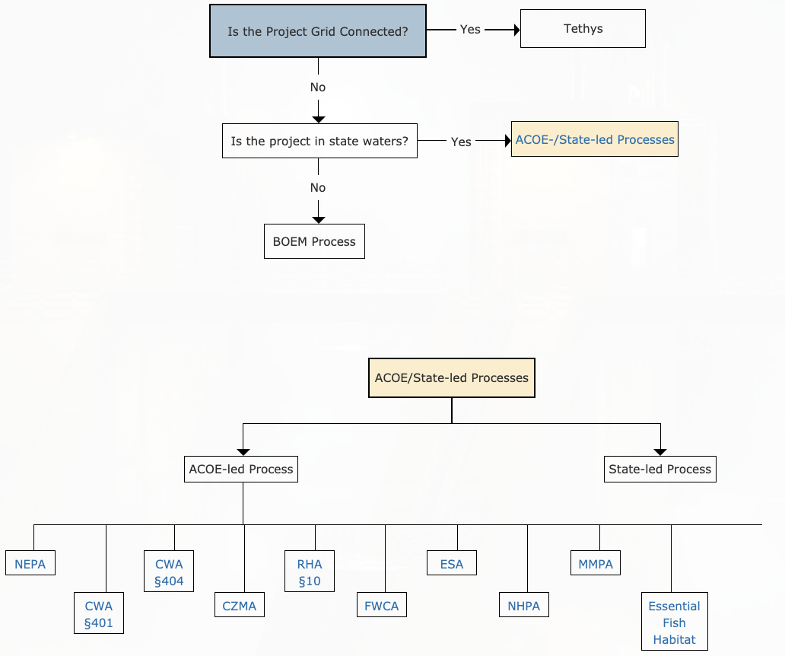

```{r setup, include=FALSE}
knitr::opts_chunk$set(echo = F)
```

## Regulatory Diagram

[](https://openei.org/wiki/MHK-env/RegulatoryDiagram)

```{r, eval=F}
# TODO:
# [3.12 Create diagrams | R Markdown Cookbook](https://bookdown.org/yihui/rmarkdown-cookbook/diagrams.html)


DiagrammeR::grViz("digraph {
  graph [layout = dot, rankdir = TB]
  
  node [shape = rectangle]        
  rec1 [label = 'Step 1. Wake up']
  rec2 [label = 'Step 2. Write code']
  rec3 [label =  'Step 3. ???']
  rec4 [label = 'Step 4. PROFIT']
  
  # edge definitions with the node IDs
  rec1 -> rec2 -> rec3 -> rec4
  }", 
  height = 500)
```


```{r, eval=F}
library("DiagrammeR")

# Click on B
# Edit *.mmd in https://mermaid-js.github.io/mermaid-live-editor
# https://rich-iannone.github.io/DiagrammeR/graphviz_and_mermaid.html#mermaid
mermaid('
graph LR
A-->B
A-->C
C-->E
B-->D
C-->D
D-->F
E-->F
A[hello]
B[test]
click B "http://www.github.com" "This is a link"
')
```

```{r, eval=F}
# sequenceDiagram
mermaid("
sequenceDiagram
  customer->>ticket seller: ask ticket
  ticket seller->>database: seats
  alt tickets available
    database->>ticket seller: ok
    ticket seller->>customer: confirm
    customer->>ticket seller: ok
    ticket seller->>database: book a seat
    ticket seller->>printer: print ticket
  else sold out
    database->>ticket seller: none left
    ticket seller->>customer: sorry
  end
")
```

